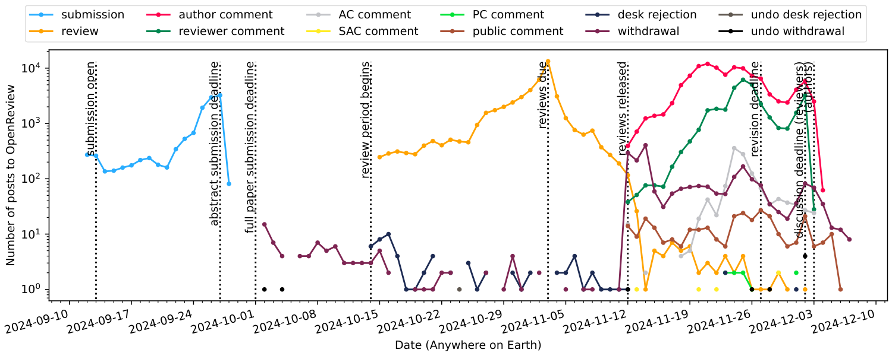
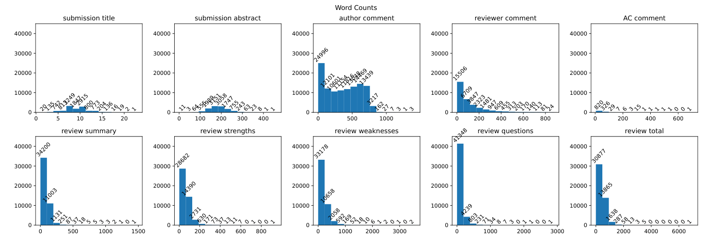

ICLR 2025: Volumetric Analaysis of Review Process
=================================================

I was a reviewer for ICLR 2025. I spent a lot of time writing my reviews and
engaging with the review process. Much more than (most of) the reviews on my
submissions. I was curious about the size of other reviewers' reviews and
also the amount of author--reviewer discussion that goes on during the review
period.

ICLR 2025 is special because all reviews and discussion happens in the open,
on OpenReview. I took inspiration
  [from](https://bastian.rieck.me/blog/2019/iclr_analysis/)
  [prior](https://github.com/shaohua0116/ICLR2020-OpenReviewData)
  [work](https://github.com/maxxu05/openreview_summarizereviews)
and wrote a script to download all abstracts and all comments via the
  [OpenReview API](https://docs.openreview.net/reference/api-v2),
then did battle with matplotlib for a couple of hours, *et voilà.*

Results: Timeline of posts and comments
---------------------------------------



One aspect of the 'volume' of discussion is the number of posts by authors
and reviewers each day. I was interested in when authors and reviewers post
rebuttals and replies.
It turned out to be no harder to extract information on all posts from
abstracts to withdrawals, which gives a more holistic picture of activity
during the review period.
The above plots the number of each type of event per day (logarithmic scale
for the counts, the spike at the review deadline is really sharp on a linear
scale).

NOTE: The timeline only goes until 2024-12-02 because I haven't collected
data for subsequent days yet. I will update this later.

Observations:

* Most reviews happen shortly before the review deadline. A substantial
  number of reviews occur in the emergency period after that deadline. A
  smaller number (but still dozens) take even longer, with one review posted
  on the final day!
* I was expecting an even sharper spike in submissions around the original
  submission deadline. However, it's not as sharp there. Probably this is
  because the real push is to get the full paper in by the full paper
  submission deadline. This script doesn't see when posts were revised to
  include a PDF.
* The author--reviewer discussion period is characterised by several peaks in
  author arctivity: First, immediately after reviews are released there is a
  spate of withdrawals.
  Then, authors begin replying, with the most active day about 10 days into
  the discussion period. Reviewers become gradually more responsive, and
  about 5 days later there is a peak in authors and reviewer comments. Due to
  an extension in the discussion deadline, there is another peak right at the
  end of the period.
* There is a consistent but low volume of public comments on some papers. I
  wasn't expecting that people other than reviewers and authors actually
  engage with OpenReview. I would be interested to inspect some of these
  comments to see what kind of comments they are on what kind of papers.

This puts my experience as a reviewer and author into perspective.

* As a reviewer, I submitted three reviews, approximately one the day before
  the review deadline, one the day of the deadline, and one the day after.
  It seems this is pretty typical.
* As an author, for one paper we managed to submit rebuttals on the 17th of
  November. This was really early, and maybe we shouldn't have pushed so
  hard. For my other paper we ran some additional experiments and submitted
  our first rebuttals by Thursday 21st, right at the first peak.
* As an author (again), unfortunately several of my reviewers completely
  failed to engage with the discussion period, even though we left plenty of
  time after our rebuttals. One thing that is not clear from this plot is how
  many reviews or rebuttals go unanswered by reviewers. I wonder how common
  this is.
* As a reviewer (again), I started getting back to my authors (those who had
  posted rebuttals) from November 26th. This was just after the reviewer
  activity peak, and maybe I could have found time earlier.

Interesting!

Results: Wordcounts for different fields
----------------------------------------



Another apsect of the 'volume' of discussion is the number of words in each
comment. Actually, what I was really interested in was the number of words *in
each review,* because I had a feeling based on the length of my review and
based on reading 
  [Bastian Rieck's post](https://bastian.rieck.me/blog/2019/iclr_analysis/)
that I probably wrote the longest review at ICLR this year.
So, I scraped the contents of the reviews and comments, counted words (just
via `len(markdown_source.split())`, nothing fancy) and histogrammed the
results.

Observations:

* I'm not exactly sure what to make of the stats for paper title and abstract
  lenghts. But it seems interesting that the average paper has around 9--10
  words in the title and an abstract under 200 words in length.
* The author comment length distribution has a somewhat weird cutoff at
  around 750 words. I think this is actually *not* surprising---OpenReview
  comments have a hard limit at 5000 characters, and so if authors want to
  write more than this they need to post their reply over multiple comments
  (my script makes no attempt to reassemble such comment sets). 750 words
  seems about right for almost filling the 5000 character limit. Actually, i
  think it's the small number of responses with substantially more words that
  require explanation, given this limit! Perhaps they are comments with
  markdown tables (or other ASCII art?).
* Reviewer comments are systematically shorter than author comments. Well,
  that perfectly matches my experience. Though there does appear to be a
  pretty long tail (again barely exceeding around 750).
* As for reviews, the first four plots show the four components of the
  review. It matches my experience as a reviewer and as an author to see that
  the weaknesses section appears to be the typically longest of the four
  sections.
* Then there is `review total` which is the aggregate of the individual
  components, the vast majority of reviews are less than 1000 words, many
  less than even 500. There are a very small number of longer reviews, going
  up to... around 7000 words
    [in one case](https://openreview.net/forum?id=XgH1wfHSX8&noteId=xTkpGvPUqb)!

This puts my experience as a reviewer into perspective... I wrote pretty long
reviews. However, in order to preserve anonymity, I will neither confirm nor
deny that I am responsible for that 7000 word review.

Anatomy of an OpenReview Forum Object
-------------------------------------

The OpenReview API lets you easily download abstracts. If you pass the right
configuration options you can also get all top-level comments or all comments
and sub-comments. But you need to know the structure of the response to get
to the data you want.

Some of the response structure is documented
  [in the API reference](https://docs.openreview.net/reference/api-v2/entities/note/fields). 
In practice, there are more fields; I dissected an example and documented the
results in [iclr2025api.md](iclr2025api.md).
This map was useful for extracting the above statistics.

Future work
-----------

This is probably all I have the energy for until next year. But here are some
more questions about volume I would be curious to see plots for:

* How many reviews do typical papers get? I know the ACs aim for 4, but I
  have personally had 7 reviews on a NeurIPS submission, which the AC said
  happened because they needed a few emergency reviews and they asked for
  more than they needed anticipating some wouldn't get around to it.
  While exploring the ICLR data, I found
    [this paper](https://openreview.net/forum?id=pCj2sLNoJq)
  which somehow ended up with 12 reviews!
* Which authors have written the most words in defence of their paper?
  The 7000 word review received a 9-part response.
  I heard a colleague of mine who wrote a much shorter review received a
  disproportionate 6-part response.
* As mentioned above, how common is it for a review to go unanswered by
  authors, or for an author's rebuttals to go ignored by reviewers? This has
  happened for several reviewers on both of my submissions this year, which
  is very disappointing, but I don't actually know how typical it is. Some
  colleagues have suggested it's to be expected. The API can tell us!
* Where is the most deeply nested comment tree? Then again, I don't always
  use the 'reply to' functionality of OpenReview, and maybe some others don't
  either; it would also be interesting to see the review with greatest number
  of total 'child' posts!
* Is it possible to extract paper revision times from the API, to see when
  people (1) uploaded PDFs compared to the deadline, and (2) uploaded
  revisions as part of the rebuttal period? I want to see how sharp a
  conference deadline is globally (it always feels sharp locally).
* Most prior analyses I've seen have emphasised review scores. I'd be
  interested in understanding connections between scores and volume, building
  off the findings from 
    [Bastian Rieck's post](https://bastian.rieck.me/blog/2019/iclr_analysis/).


Instructions
------------

First, set up a virtual environment. Do this however you like. Here's one
way:

```
python -m venv iclrdata.venv
source iclrdata.venv/bin/activate
pip install -r requirements.txt
```

Then, download the reviews data.

```
python main.py download
```

Then you can plot the above two plots as PDFs as follows:

```
python main.py timeline
python main.py wordcount
```

Note: if using this script in future, be aware that the API might have
changed. Also the structure of forums might change for future iterations of
the conference. Good luck!
